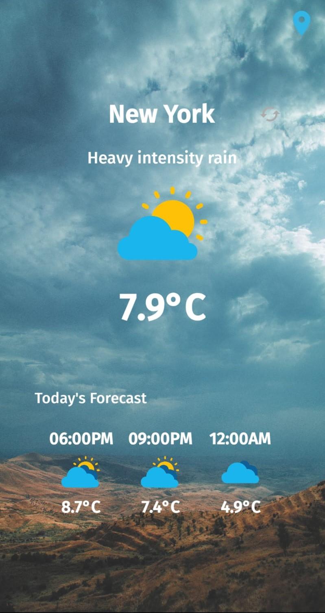
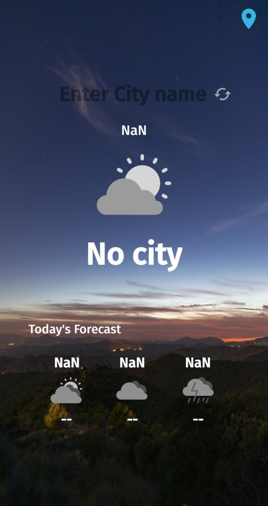

# WeatherApp - Android
Welcome to the WeatherApp for Android! This mobile application provides a visually appealing experience by incorporating an ImageView for weather type and dynamically changing background images based on the time of day. The app seamlessly integrates real-time weather information and today's forecast for any city, sourced from two free APIs provided by OpenWeather.

## Screenshots
  


# Features
### Live Temperature: 
Get the current temperature and weather for any city with just a few taps.
### Today's Forecast: 
Access the weather forecast for today, including details such as temperature, time.
### Dynamic Backgrounds: 
Enjoy a visually immersive experience with background images that change based on the time of day.
### Weather Type Image: 
Visualize the current weather type with an accompanying image.

# GPS Location
Added GPS location when you open the app it will automatically detect your location and show you the weather of that city

# APIs Used
This app relies on the following free APIs from the OpenWeather website: https://openweathermap.org/

### Current Weather Data API: 
Fetches the current weather conditions for a specified city.
### One Call API: 
Retrieves the weather forecast, including minutely and hourly forecast data.

# Visual Enhancements
## ImageView for Weather Type:
The app displays an ImageView to visually represent the current weather type, providing users with a quick and intuitive understanding of the weather conditions.

## Dynamic Background Images:
Background images change dynamically based on the time of day, enhancing the overall user experience and reflecting the current atmospheric conditions.
# How to Use
## Clone Repository:
Clone the repository to your local machine and open it in Android Studio.

```bash
git clone https://github.com/your-username/WeatherApp.git
```
## Build and Run:
Build and run the app on your Android device or emulator using Android Studio.

## Explore the Weather:
Open the app, enter the city of interest, and explore the current weather conditions and today's forecast.

# Configuration
Before running the application, make sure to update the API keys in the Constants.java file with your OpenWeather API keys.

```bash
String apikey = "your_current_weather_api_key";
```

# Contributions
Contributions to the project are welcome! If you have any ideas for improvements or new features, please open an issue or submit a pull request.

Feel free to use, modify, and distribute the code.

Enjoy using the WeatherApp on your Android device!
